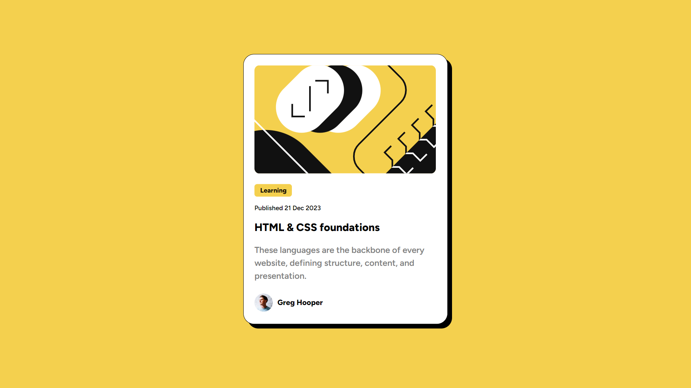

# Frontend Mentor - Blog preview card solution

This is a solution to the [Blog preview card challenge on Frontend Mentor](https://www.frontendmentor.io/challenges/blog-preview-card-ckPaj01IcS). Frontend Mentor challenges help you improve your coding skills by building realistic projects. 

## Table of contents

- [Overview](#overview)
  - [The challenge](#the-challenge)
  - [Screenshot](#screenshot)
  - [Links](#links)
- [My process](#my-process)
  - [Built with](#built-with)
  - [What I learned](#what-i-learned)
  - [Continued development](#continued-development)
- [Author](#author)

**Note: Delete this note and update the table of contents based on what sections you keep.**

## Overview

This is a blog preview card created with HTML and CSS.

### The challenge

Users should be able to:

- See hover and focus states for all interactive elements on the page

### Screenshot

### Links

- Solution URL: [Blog-Preview-Card](https://github.com/nathangrissett/Blog-Preview-Card)
- Live Site URL: [Blog Preview Card](https://nathangrissett.github.io/Blog-Preview-Card/)

## My process

1. Wrote the HTML
2. Updated font properties
3. Added padding, borders, and margins
4. Added shadows
4. Added background/text colors
5. Added hover properties
6. Added horizontal alignment
7. Added "vertical alignment"

### Built with

- HTML
- CSS

### What I learned

I learned that I still struggle with alignment to the center. In my last project (QR Code), I also struggled with alignment to the center. So, for this Blog Preview Card project, I decided to align the card last, after finishing the rest of the CSS (see "My Process"). This proved to be a bad idea. I got a very helpful comment on my QR Code project showing me how to use flexbox to align the card to the center. I should have done this first, before adding any other CSS, because I was unable to use it to align the card after I finished the rest of the CSS. I tried to apply it to the body, but it did not work. I ended up using display:table and margin:auto for horizontal alignment, and transform for "vertical alignment" (which doesn't actually vertically align, just moves it to a specific position vertically).

### Continued development

After I submit this project, I will practice center alignment specifically until I get really good at it.

## Author

- Website - [Nathan Grissett](https://github.com/nathangrissett/)
- Frontend Mentor - [@nathangrissett](https://www.frontendmentor.io/profile/nathangrissett)